# Campaign and Publisher Management System

This is a test project built with Laravel 9, Livewire, and TailwindCSS for managing campaigns, publishers, websites, apps, and simple statistics. It includes features for creating, editing, and managing different entities, along with an admin section for managing shortlinks and offerwalls.

## Table of Contents

- [Features](#features)
- [Screenshots](#screenshots)
- [Installation](#installation)
- [Usage](#usage)
- [Database Seeding](#database-seeding)
- [License](#license)

## Features

### Campaign Management
- Create, edit, and manage banner and pop campaigns.
- Dashboard for viewing campaign statistics.

### Publisher Management
- Manage websites and apps for publishers.
- Create, edit, and view details of websites and apps.

### Admin Management
- Manage shortlinks and offerwalls.
- Simple stats dashboard for admin insights.

### Technology Stack
- **Backend**: Laravel 9
- **Frontend**: Livewire, TailwindCSS

## Screenshots

### Campaign Management Dashboard
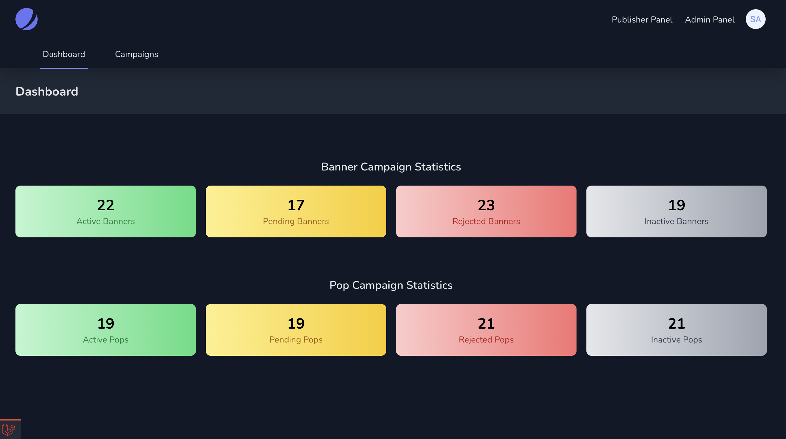
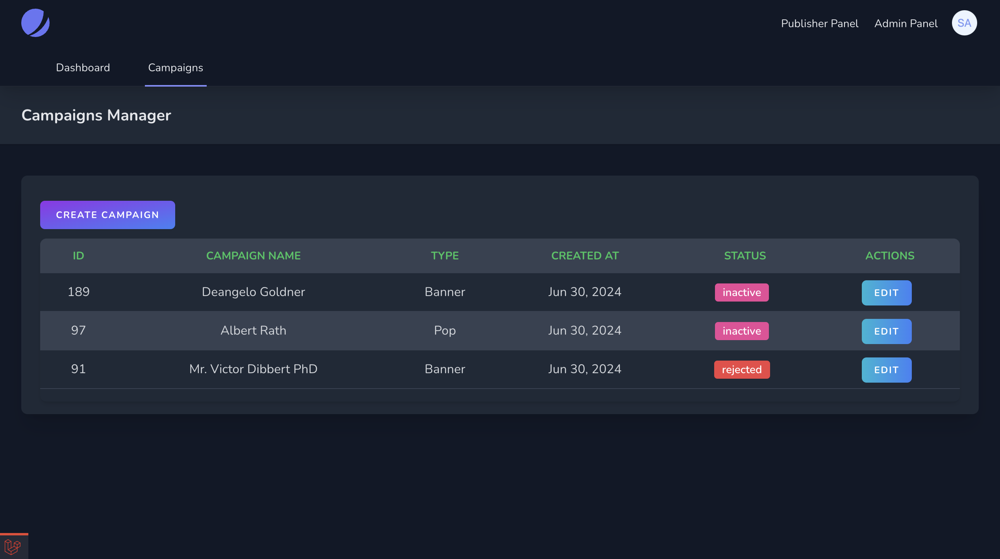
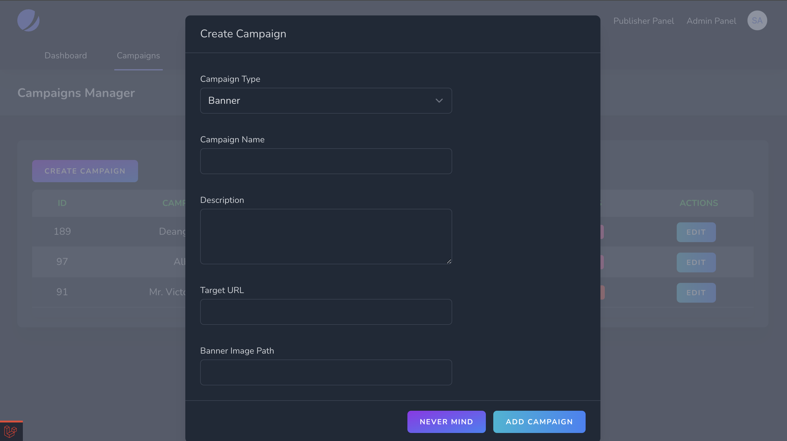

### Publisher Management Dashboard
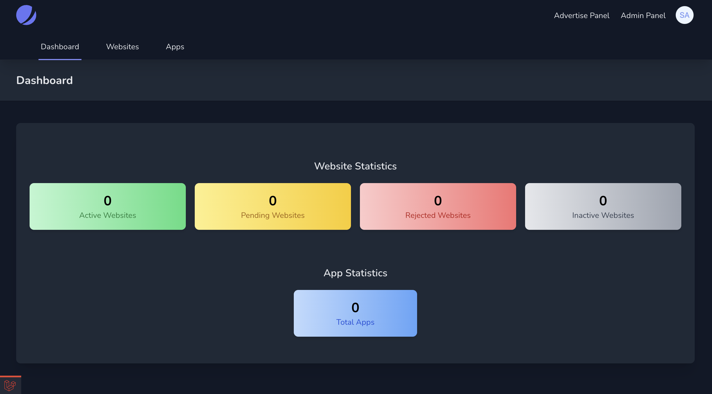
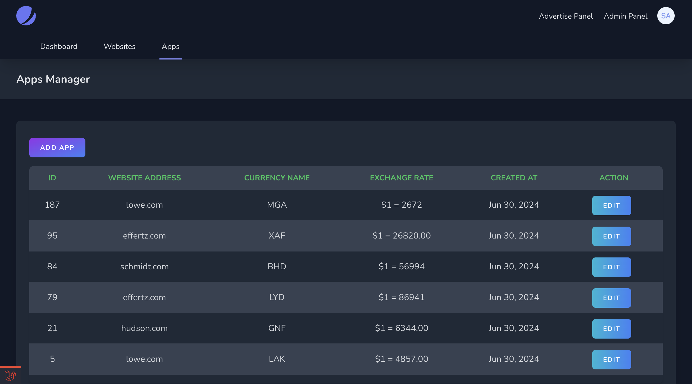
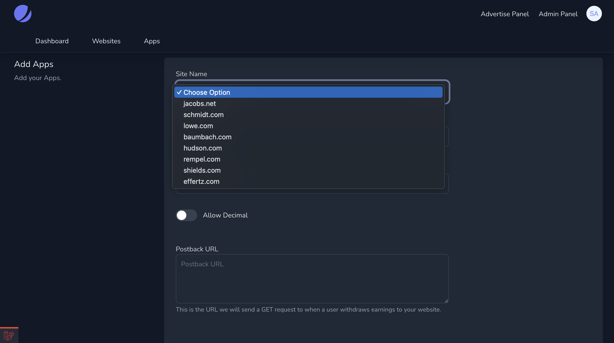
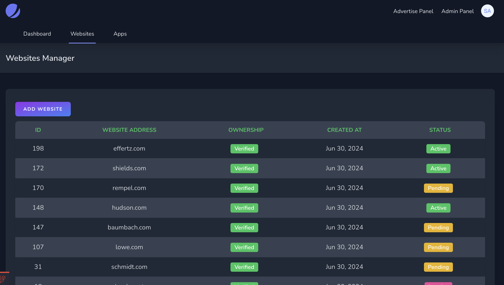
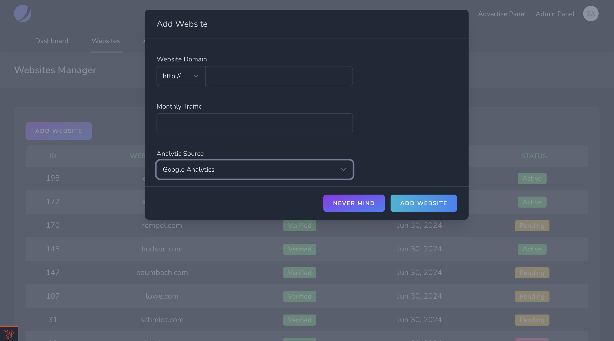

### Admin Section
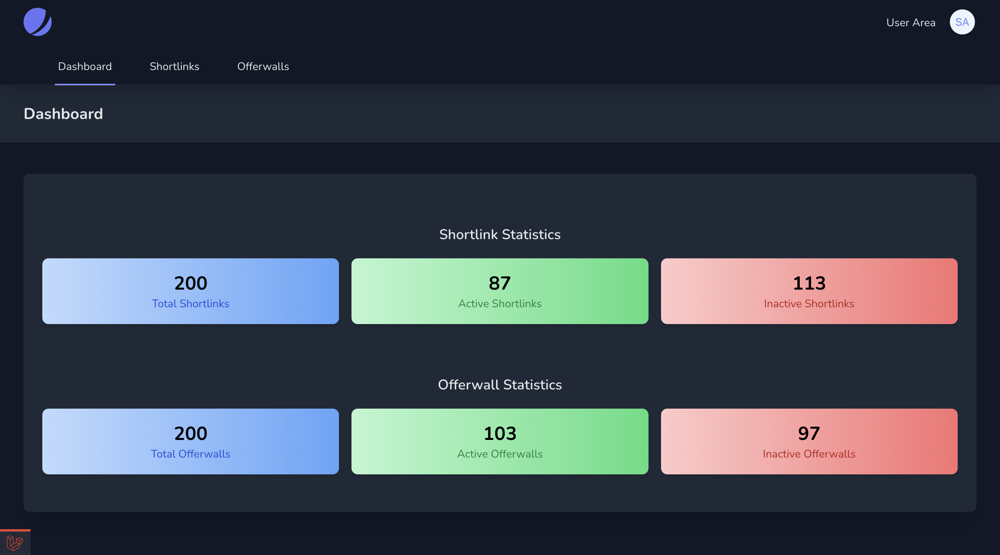
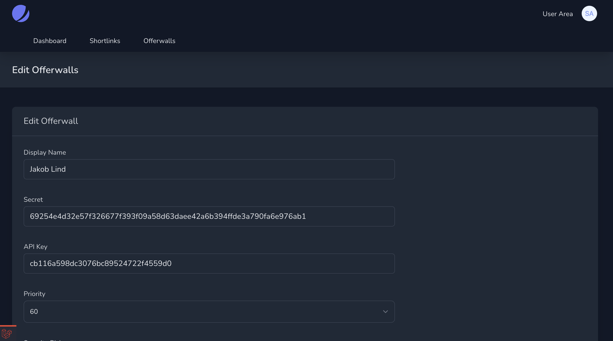
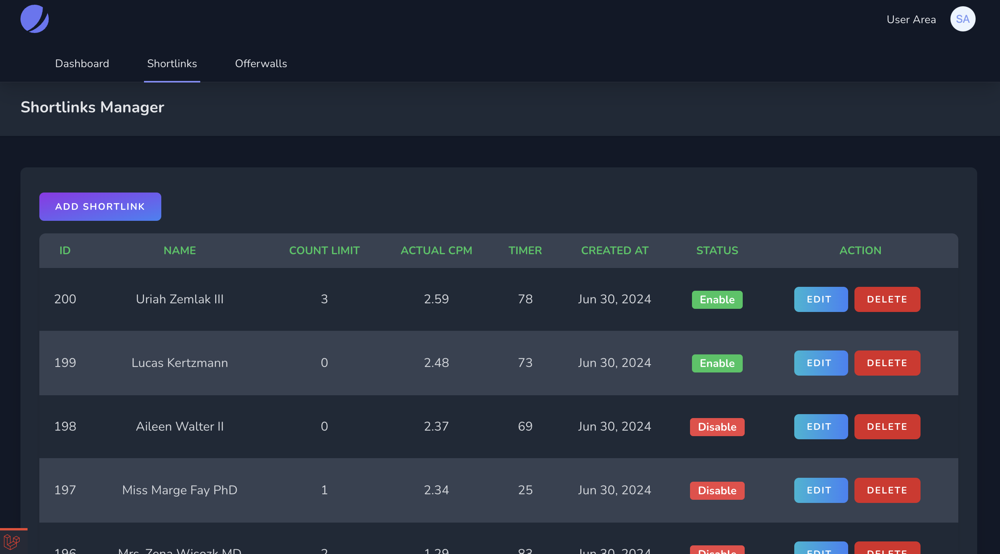

## Installation

1. **Clone the repository:**

    ```bash
    git clone https://github.com/saidurbhuiyan/livewireads.git
    cd livewireads
    ```

2. **Install dependencies:**

    ```bash
    composer install
    npm install
    npm run dev
    ```

3. **Environment setup:**

   Copy the `.env.example` file to `.env`:

    ```bash
    cp .env.example .env
    ```

   Generate an application key:

    ```bash
    php artisan key:generate
    ```

   Update your `.env` file with your database credentials and other necessary configuration.

4. **Run migrations and seed the database:**

    ```bash
    php artisan migrate --seed
    ```

## Usage

1. **Start the development server:**

    ```bash
    php artisan serve
    ```

2. **Access the application:**

   Open your browser and navigate to `http://localhost:8000`.

3. **Admin Section:**

   To access the admin section for managing shortlinks and offerwalls, navigate to `http://localhost:8000/admin/dashboard`.

## Database Seeding

This project includes database seeding to populate the database with initial data. To run the seeders, use the following command:

```bash
php artisan migrate --seed
```

This will run the migrations and seed the database with sample data for testing.

License
This project is licensed under the MIT License.
